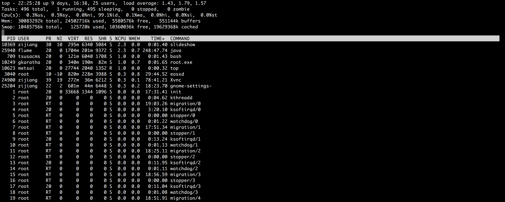

# Advanced Linux Tutorial

## Useful commands

### top

top指令能查詢server的使用狀況，包含CPU、記憶體以及他人對於此server的使用情況。

進入top查詢之後可以按q退出。




### scp

scp指令主要是用來上傳本地檔案到server或是下載server檔案到本地
。

* **上傳檔案到server**

我們以Lxplus為例，假設我們要在本地的電腦上傳一個叫`a.txt`的檔案，這個檔案的路徑位置在`/Users/ploww/ploww`，然後你想要把檔案上傳到Lxplus裡的這個位置`/afs/cern.ch/work/m/metsai`，以下指令我要在**本地**輸入來完成以上動作

```bash
scp /Users/ploww/ploww/a.txt youraccount@lxplus.cern.ch:/afs/cern.ch/work/m/metsai
```

* **下載server上的檔案到本地**

假設我們在server有一個檔案`/afs/cern.ch/work/m/metsai/a.txt`，然後我們想要把檔案從Lxplus下載到本地的位置`/Users/ploww/ploww`，以下指令我們要在**本地**輸入來完成以上動作

```bash
scp youraccount@lxplus.cern.ch:/afs/cern.ch/work/m/metsai/a.txt /Users/ploww/ploww 
```

