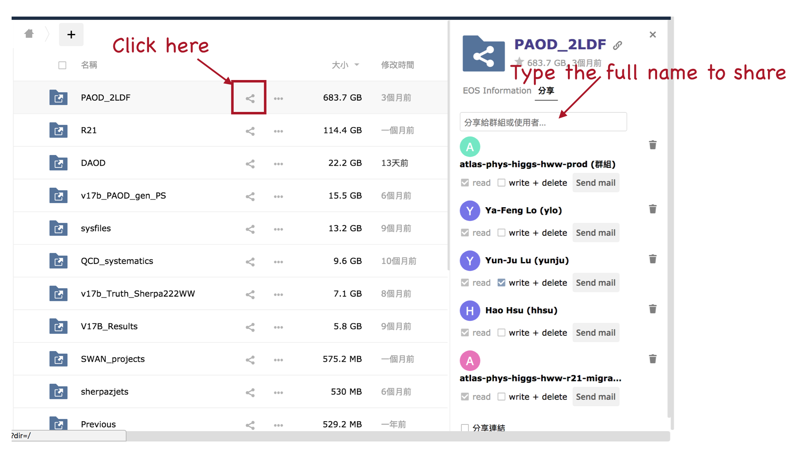
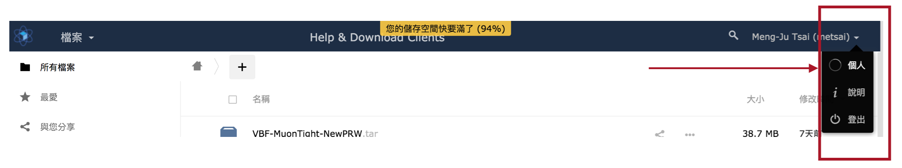
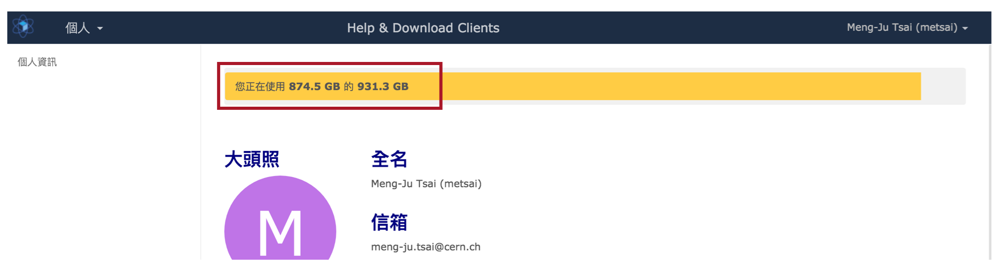

# CERNBox and EOS

## Introduction 

[CERNBox](https://cernbox.cern.ch/) corresponds to the [EOS space](lxplus.md#eos-space). You can also think the CERNBox as an online hard drive to store your files. 

### Guideline

The guideline of CERNBox is shown [here](https://cernbox.cern.ch/index.php/settings/help). 

### Sharing

It's not available to change the authorities of the files by `chmod` in the EOS space, instead, to share with others, we should **share** them with others by CERNBox. 

The followings are the instructions about sharing in the CERNBox. 

* We normally key in the full name of who you would like to share. It's because sometimes CERNBox cannot find people with only a part of the name.
* We can also share with e-groups.

### Check quota of CERNBox/EOS space

* [Check quota with command line](https://cern.service-now.com/service-portal/article.do?n=KB0002979)
* Check quota in the CERNBox

