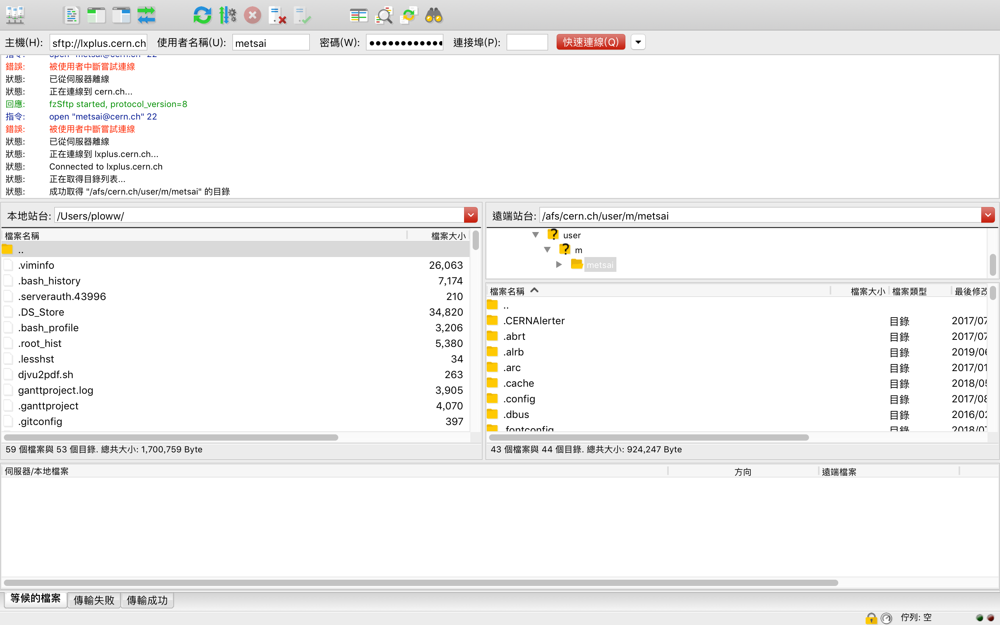

# Linux \(Advanced\)

## Useful commands

### Initialize your environment

You could add some commands to initialize the environment in the `~/.bashrc` for Linux system or `~/.bash_profile` for MAC system.

例如，我們可以使用alias來縮短我們的指令，並且把alias的指令加在`~/.bashrc`，如此我們就可以在每次登入terminal或是cluster時，都可以馬上使用此指令。

例如，我們可以把長長的[`ssh`](linux-advanced.md#ssh)指令縮短成一個字母！我們只需要在`~/.bashrc`加上：

```text
alias m='ssh -X youraccount@lxplus.cern.ch'
```

透過這個`alias`，我們以後只需要用在bash shell裡打上`m`，就等同於打上`ssh -X youraccount@lxplus.cern.ch`這個指令了！

順帶一題，更改完`~/.bashrc`檔案時，如果要馬上看到效果，那需要先用[`source`](http://linux.vbird.org/linux_basic/0320bash/csh/no3-8-03.html) 來執行一遍，讓新的環境擁有這個新的指令。

```text
source ~/.bashrc
```

如果你沒有`source` 也沒關係，下次登入terminal時，電腦將會自動做`source ~/.bashrc`的步驟。

### sudo & su

這裡有詳細的[介紹](https://blog.gtwang.org/linux/sudo-su-command-tutorial-examples/)可以參考，以下我們提供幾個很常見的指令：

我們可以透過以下指令進入`root`身份

```text
su -
```

另外，當你要暫時以`root`身份來使用某些指令時，可以在前面加上`sudo`

```text
sudo <some commands>
```

例如以下指令，就會顯示`root`身份的家目錄：

```text
sudo ls ~
```

許多人會習慣拿 `sudo` 與 `su` 放在一起使用，這樣藉由 `su` 取得一個新的 shell，而且也不用輸入 `root` 的密碼，通常在 Ubuntu Linux 中很常用：\(from [介紹](https://blog.gtwang.org/linux/sudo-su-command-tutorial-examples/)\)

```text
sudo su -
```

### top

top指令能查詢server的使用狀況，包含CPU、記憶體以及他人對於此server的使用情況，進入top查詢之後可以按q退出。


### tar （打包\)

#### 打包：

```text
tar cvf FileName.tar DirName
```

**解包：**

```text
tar xvf FileName.tar
```

### ssh

\*\*\*\*[**Secure Shell**](https://zh.wikipedia.org/wiki/Secure_Shell)（安全外殼協定，簡稱**SSH**）是一種加密的[網路傳輸協定](https://zh.wikipedia.org/wiki/%E7%BD%91%E7%BB%9C%E4%BC%A0%E8%BE%93%E5%8D%8F%E8%AE%AE)，可在不安全的網路中為網路服務提供安全的傳輸環境

### scp

scp指令主要是用來上傳本地檔案到server或是下載server檔案到本地
。

* **上傳檔案到server**

我們以Lxplus為例，假設我們要在本地的電腦上傳一個叫`a.txt`的檔案，這個檔案的路徑位置在`/Users/ploww/ploww`，然後你想要把檔案上傳到Lxplus裡的這個位置`/afs/cern.ch/work/m/metsai`，以下指令我要在**本地**輸入來完成以上動作

```bash
scp /Users/ploww/ploww/a.txt youraccount@lxplus.cern.ch:/afs/cern.ch/work/m/metsai
```

* **下載server上的檔案到本地**

假設我們在server有一個檔案`/afs/cern.ch/work/m/metsai/a.txt`，然後我們想要把檔案從Lxplus下載到本地的位置`/Users/ploww/ploww`，以下指令我們要在**本地**輸入來完成以上動作

```bash
scp youraccount@lxplus.cern.ch:/afs/cern.ch/work/m/metsai/a.txt /Users/ploww/ploww 
```

* **下載或上傳一整個資料夾**

如果資料夾內的檔案很多，那他會對每個檔案一個一個下載，因此需要讀取每個檔案，下載或上傳一整個資料夾會**非常耗時**！因此我們可以先把**資料夾**[**打包**](linux-advanced.md#tar-da-bao)，然後再下載**打包後的資料夾 \(.tar\)。**

假設檔案在Lxplus上，因此我們在Lxplus的檔案位置打上以下指令並將資料夾打包

```bash
tar cvf FileName.tar DirName
```

回到我們的本機（自己的電腦），然後打上這個指令來下載這個打包後的資料夾

```text
scp youraccount@lxplus.cern.ch:/afs/cern.ch/work/m/metsai/FileName.tar ~
```

### FTP service 

FTP就是File Transfer Protocol \(client and server\)，它是一種獲得網際網路世界普遍採用的通訊協定之一，我們可以透過FTP服務，來完成和`scp`一樣的事情，我們常用的FTP檔案傳輸軟體是[FileZilla](https://filezilla-project.org/)。

[FileZilla](https://filezilla-project.org/) 的好處就是可以提供圖形化介面讓你較容易的把你想要下載或上傳的東西用游標即可以完成，如此就不用想下載東西就需要打長長一串的`scp`指令。

## Hand-on sessions

### 用FileZilla下載東西

用FileZilla登入Lxplus，我們要在主機那個空格輸入

```text
sftp://lxplus.cern.ch
```

後面則打上你的CERN帳號跟密碼，如此就能登入進去Lxplus了，你就可以開始使用FTP服務囉，enjoy!



你如果要下載或上傳東西，就只需要把你要的檔案往左\(或右\)拉來下載\(上傳\)！

### 縮短你的指令

## Reference

\[1\] [http://www.raidenftpd.com/tw/ftp.html](http://www.raidenftpd.com/tw/ftp.html)

