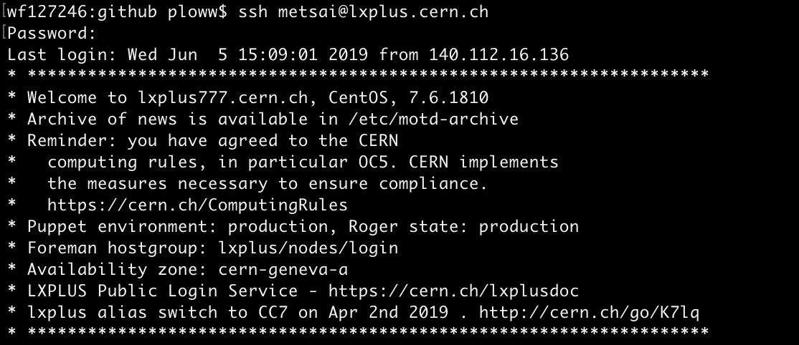

# Lxplus

## Introduction 

[Lxplus](https://lxplusdoc.web.cern.ch/lxplusdoc/) \(Linux Public Login User Service\) is the interactive logon service to Linux for all CERN users. We normally work with Lxplus since the environments in the Lxplus are finely set with the ATLAS experiment. It could interact to the eos system and CERNBox, which are used to stored dataset. 

### Working in the Lxplus  

Once you have CERN account, we can access the Lxplus by the following commands:

#### Log in Lxplus with different systems

Log in Lxplus with CentOS CERN 7 \(CC7\) system

```bash
ssh yourAccount@lxplus.cern.ch​
```

Log in Lxplus with Scientific Linux 6 \(SLC 6\) system

```bash
ssh yourAccount@lxplus6.cern.ch
```

#### Log in specific node of Lxplus 

For example, you can log in some specific node \(lxplus616\) by `ssh`

```
ssh yourAccount@lxplus616.cern.ch​
```

### Commands in the Lxplus

#### Set up for the ATLAS environment

You should initialize with the following command when you login every time

```bash
setupATLAS
```


#### Useful commands

* Check the quota in user or working directory 

```bash
fs lq --human
```

## Hand-on sessions

### Log in the Lxplus

We use `ssh` to log in the Lxplus. 

```
ssh yourAccount@lxplus.cern.ch​
```

Note that when you key in your password, _**your password will not be shown on your screen**_. 



### Setup the ATLAS environment

```text
setupATLAS
```

#### Setup ROOT

We could use `lsetup` to setup ROOT

```text
lsetup root
```

However, currently we were required to use a specific version of ROOT. Therefore, here I use the recommended version of ROOT.

```bash
lsetup "root 6.14.04-x86_64-slc6-gcc62-opt" 
```

Then we can open ROOT by 

```text
root
```

#### Displaying issue

When you open root, it will show an opening animation and this require you to connect the server with X windows, what we've discussed in the [previous section](linux_basic.md#da-duan-terminal). Please follow the hand-on session to [install X windows](linux_basic.md#install-x-windows). Then we should connect the Lxplus with the following command

```text
ssh yourAccount@lxplus.cern.ch​
```


