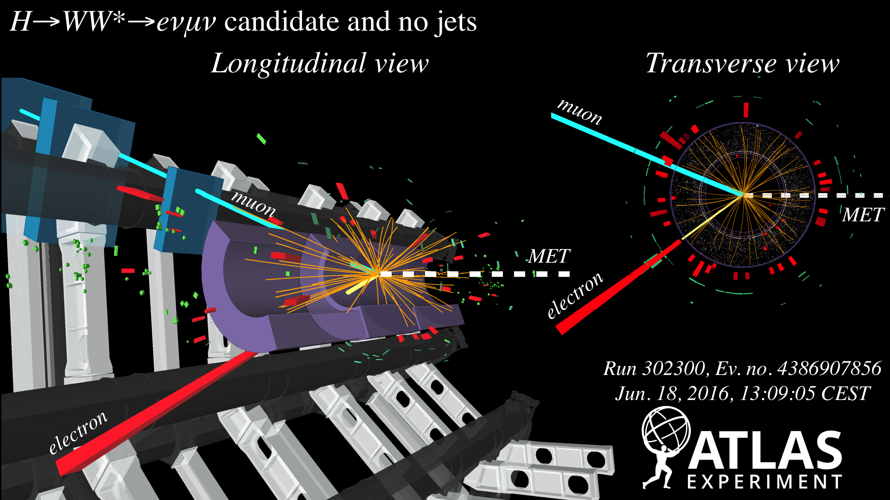
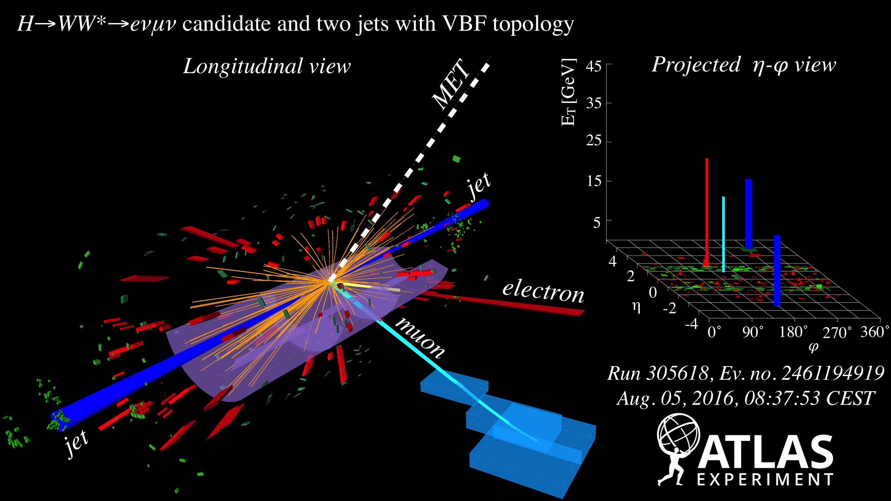

# H→WW

On July 4th 2012, the European Organization for Nuclear Research \(CERN\) announced the discovery of the hypothesized Standard Model Higgs Boson at the Large Hadron Collider \(LHC\). The discovery of Higgs boson determines the Brout-Englert-Higgs mechanism which breaks the electroweak symmetry and gives masses to massive gauge bosons. The discovery of the Higgs boson provides physicists opportunities to the new physics beyond Standard Model. In 2015, the LHC has restarted the 2nd run \(Run-2\) with the upgraded center-of-mass energy 13 TeV. Our group focuses on the analysis using the data collected in Run-2.

Now, our group is highly involved in ATLAS H→WW\*→ℓυℓυ analysis. We focus on the gluon-gluon fusion \(ggF\) and vector boson fusion \(VBF\) categories.

We currently make impacts on the following topics

* Optimization of the selection of the VBF Higgs phase space
* Evaluation of the WW background and its relevant uncertainties
* Evaluation of Pile-up contamination in the VBF phase space
* Event displays for the VBF and ggF signals

