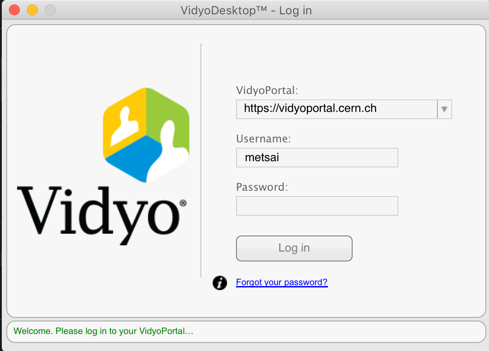
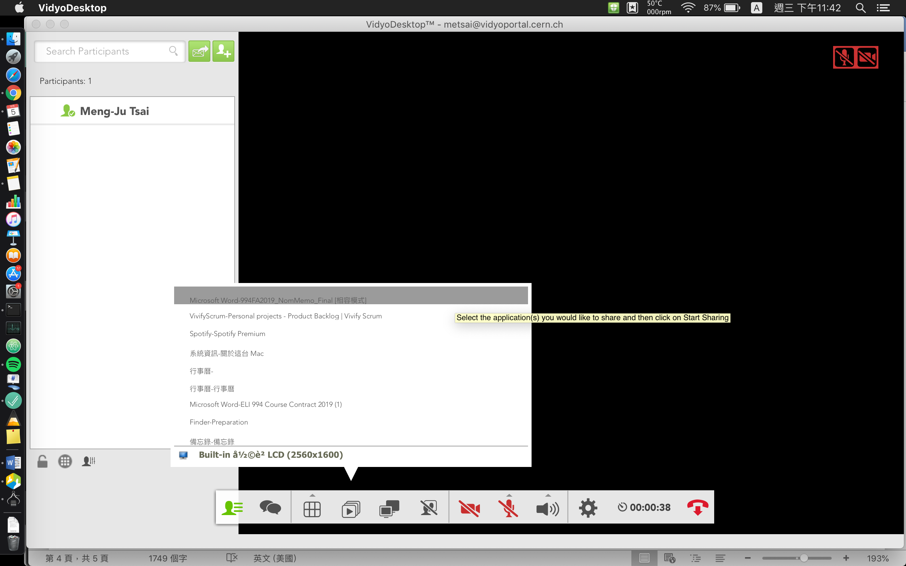

# Physics Analysis

## Introduction

To start becoming a researcher in the ATLAS experiment, 

### Hand-on session

Meetings 

#### 

Here I listed some basic but very useful links for introduction. Many _jargons_ are explained in the following links. 

* \*\*\*\*[**The ATLAS Physics Analysis Workbook**](https://twiki.cern.ch/twiki/bin/view/AtlasProtected/PhysicsAnalysisWorkBook)
  * [Physics Analysis Workbook: Release 21](https://twiki.cern.ch/twiki/bin/view/AtlasProtected/PhysicsAnalysisWorkBookRel21)
  * [Physics Analysis Workbook: Release 20](https://twiki.cern.ch/twiki/bin/view/AtlasProtected/PhysicsAnalysisWorkBookRel20)

### ATLAS Public Results

* [ATLAS Conference Notes](https://twiki.cern.ch/twiki/bin/view/AtlasPublic/CONFnotes)

### Tutorials

* [ATLAS Software Tutorial](https://atlassoftwaredocs.web.cern.ch/ABtutorial/)
* [ATLAS Software Tutorial meetings](https://indico.cern.ch/category/397/)

### Useful links

* [Good Run lists](https://twiki.cern.ch/twiki/bin/viewauth/AtlasProtected/GoodRunListsForAnalysisRun2)

## Hand-on sessions

### Join meetings by vidyo

We use [**vidyo**](http://information-technology.web.cern.ch/services/fe/vidyo) to connect meetings online. It provides services on different platforms including Mac OS, Windows, Linux and ios. 

To log in, you should key the following string in the blank shown below, and then your CERN account and its password. 

```text
https://vidyoportal.cern.ch
```



#### Share your slides




