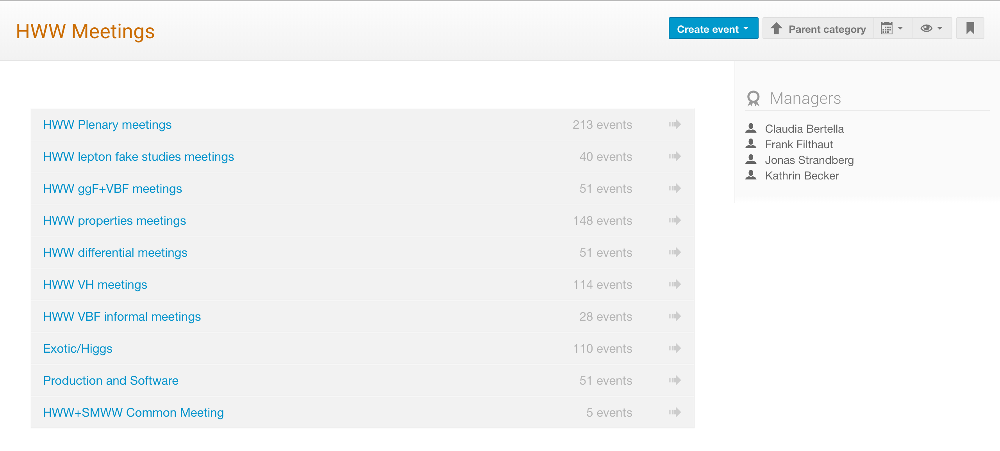

# HWW

## Introduction

We measure several properties of the Higgs boson by HWW analysis including the cross section of the Higgs production, mainly on gluon fusion and vector boson fusion, and the Higgs coupling to W gauge bosons. We compare the data and the Monte Carlo \(MC\) simulated samples to find whether all the things are consistent with the Standard Model.  In NTHU HEP group, we focus on the ggF and VBF Higgs boson coupling measurement. 

In this page, many useful resources are summarized below. You can start with the Run-1 paper to have basic knowledge and begin to work on the analysis with the HWW framework. 

_**In the end of this page, there will have a hand-on session for you to follow what you can do to start you research!**_

## Resources of ATLAS HWW group 

### Frameworks

We have two important frameworks, one for physics analysis and the other one is for the production of the samples we used in the analysis framework. 

* [HWWAnalysisCode](https://gitlab.cern.ch/atlas-physics/higgs/hww/HWWAnalysisCode) is the **analysis code** for the HWW subgroup based on the Common Analysis Framework \(CAF\).
* [HWWPhysicsxAODMaker](https://gitlab.cern.ch/atlas-physics/higgs/hww/HWWPhysicsxAODMaker) is the **production code** for the HWW subgroup based on the ASG AthAnalysis release.

### HWW conveners \(會議召集人\)

#### Current conveners

* **Jonas Strandberg**
  * jonas.strandberg@cern.ch
* **Kristin Lohwasser**
  * kristin.lohwasser@cern.ch

### Meetings

We have several meetings related to the HWW. Feel free to join the meetings interesting to you. All HWW meetings are summarized [here](https://indico.cern.ch/category/6144/). 

The ongoing results will always be discussed in the [**HWW weekly meeting**](https://indico.cern.ch/category/6420/). This is ****the main place we discussed for the all HWW studies. Moreover, there are also meeting for [production and software meeting](https://indico.cern.ch/category/8790/) focusing on the CAF and PxAOD production. 

#### Weekly meetings

* _\*\*\*\*_[_**HWW weekly meeting**_](https://indico.cern.ch/category/6420/)_\*\*\*\*_
* _\*\*\*\*_[Production and software meeting](https://indico.cern.ch/category/8790/)
* [HWW ggF+VBF analysis meeting \(HIGG-2016-07\)](https://indico.cern.ch/category/8242/)

**HWW workshops**

* [HWW workshop in 2018](https://indico.cern.ch/event/714538/timetable/?view=standard)
* [HWW workshop in 2016](https://indico.cern.ch/event/587413/timetable/?view=standard)
* [HWW Run-II preparation workshop](https://indico.cern.ch/event/383521/timetable/?view=standard)

#### HWW software tutorial

* _\*\*\*\*_[_**CAF & PxAOD Tutorial \(Dec 2018\)**_](https://indico.cern.ch/event/771763/timetable/?view=standard)_\*\*\*\*_
* _\*\*\*\*_[Common Analysis Framework - CAF Tutorial \(May 2018\)](https://indico.cern.ch/event/719951/timetable/?view=standard)

### Websites and useful links

#### Official websites for HWW in twiki

* [Higgs WW](https://twiki.cern.ch/twiki/bin/view/AtlasProtected/HiggsWW)
* [HWW Framework](https://twiki.cern.ch/twiki/bin/view/AtlasProtected/HiggsWWAnalysisFramework)

### Documentation and Results

Several papers and notes are summarized in the twiki pages. Several previous papers can be easily accessible in the following pages. 

* [Documentation for final Run 1 papers](https://twiki.cern.ch/twiki/bin/view/AtlasProtected/HiggsWW#Documentation_for_final_Run_1_pa)
* [Documentation for Run-2 analyses on partial dataset](https://twiki.cern.ch/twiki/bin/view/AtlasProtected/HiggsWW#Documentation_for_Run_2_analyses)
* [Documentation for Run-2 analyses on full dataset](https://twiki.cern.ch/twiki/bin/view/AtlasProtected/HiggsWW#NEW_Documentation_for_Run_2_anal)

Here shows some of the quick links to Run 1 and Run 2 papers and CONF notes. 

#### Run-1

* [HWW Run-1 paper ](https://arxiv.org/abs/1412.2641)
* [HWW Run-1 ](https://link.springer.com/content/pdf/10.1140%2Fepjc%2Fs10052-015-3436-3.pdf)[properties](https://link.springer.com/content/pdf/10.1140%2Fepjc%2Fs10052-015-3436-3.pdf) [paper \(spin, parity\)](https://link.springer.com/content/pdf/10.1140%2Fepjc%2Fs10052-015-3436-3.pdf)

#### Run-2

* [HWW Run-2 CONF Note](https://cds.cern.ch/record/2304936/files/ATL-COM-PHYS-2018-148.pdf?)
* [HWW Run-2 Optimization Note](https://cds.cern.ch/record/2276101/files/ATL-COM-PHYS-2017-1089_2.pdf?)
* [HWW Run-2 Supporting Note](https://cds.cern.ch/record/2276143/files/ATL-COM-PHYS-2017-1094.pdf?)
* [HWW Run-2 paper](https://arxiv.org/abs/1808.09054)
* [SVN for Run-2 analysis note](https://svnweb.cern.ch/trac/atlasphys-hsg3/browser/Physics/Higgs/HSG3/HWWRunII/NotesPapers/SupportingNotes/ggFVBF2017/AnalysisNote/trunk?order=name)

There are some scattered slides stored in the [sharepoint](https://espace.cern.ch/atlas-phys-higgs-hww-run2/_layouts/15/start.aspx#/SitePages/Home.aspx). 

## E-groups

Please subscribe the mailing lists from [here](https://e-groups.cern.ch/e-groups/EgroupsSearchForm.do). For the HWW groups, we have two main mailing lists related to the analysis code and the production results. 

**ATLAS Higgs WW general mailing list**	

* atlas-phys-higgs-hww@cern.ch

**Announcements and QA for users of QFramework and CAF**	

* qframework-users@cern.ch

**Production e-group for Higgs H-WW subgroup \(HSG3\)**	

* atlas-phys-higgs-hww-prod@cern.ch

## Hand-on sessions

### Subscribe HWW e-groups

* Subscribe following three e-groups and follow the announcement and discussion in the emails. 
  * atlas-phys-higgs-hww@cern.ch
  * qframework-users@cern.ch
  * atlas-phys-higgs-hww-prod@cern.ch

1. Open the [e-group website](https://e-groups.cern.ch/e-groups/EgroupsSearch.do) and search the terms **hww** and **qframework.** 
2. Click the _**subscribe**_ button in the Actions. 

![\[Step 1\] Key in the terms hww and qframework.  ](../../.gitbook/assets/ying-mu-kuai-zhao-20190605-xia-wu-7.39.24.png)

![\[Step 2\] Click the subscribe button ](../../.gitbook/assets/ying-mu-kuai-zhao-20190605-xia-wu-8.02.55.png)

### Join the [HWW weekly meeting](https://indico.cern.ch/category/6420/) in every Tuesday

Normally, the HWW conveners will announce the HWW weekly meetings in the _ATLAS Higgs WW general mailing list_ every week. So, please subscribe it and keep track of the information of meeting.

