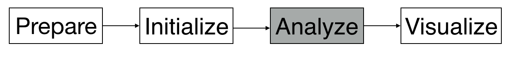

# Analyze

## Introduction



The `analyze` step is followed by the `initialize` ****step. The following is the command about how we analyze with configuration file and we take the VBF as example:

```bash
./analyze.py config/master/VBF/analyze-VBF-default.cfg
```

Notice that a more convenient way, `submit`, is introduced in the [subsection](analyze-adv.md).

### Tags

#### inputFile and outputFile

These are same as the [tags](../initialize/#inputfile) introduced before. 

#### channels

We have four options for the channels including same-flavor final states, `ee` and `μμ`, as well as different flavor final states, `eμ` and `μe`.

#### cuts

In this `analyze` step, we include the cut files, which are used to define cuts to select events, in the configuration file. More details are introduced in the [subsection](cuts.md). 

```text
cuts: config/cuts/common/default-couplings.def, config/cuts/VBF/VBF.def
```

#### Observables

Observables are the features which we can _observe_ an event. In the configuration file, we include the snippets, which will further call the source codes to calculate the features.

```text
customObservables.directories: observables/common, observables/VBF
customObservables.snippets: HWWTriggerWeight, HWWGRL,HWWTrigger,HWWbTagCounter,HWWMETRel,HWWMtautau,EventIndex,HWWpTSumobs,HWWFakeFactorWeight,HWWDRObs,HWWLeptonIDObservable,HWWRunNumber,SampleNorm,HWWCorrectedAverageMu,HWWJetCounter, HWWnLep, HWWSumMljobs, HWWOLVobs, HWWCJVobs, HWWMT2Obs, HWWMuonIsoWeight, HWWMuonTTVAWeight, HWWMuonRecoWeight, HWWElectronRecoWeight, HWWElectronIDWeight, HWWElectronIsoWeight, HWWJVTWeight, HWWBTagWeight, HWWPRWWeight, HWWMCWeight
```

There are very helpful tutorials for observables:

* [Observables - Injecting Physics into CAF](https://indico.cern.ch/event/771763/contributions/3207857/attachments/1767866/2872862/181210_Observables.pdf)
* [Writing Custom Observables \(on gitlab\)](https://gitlab.cern.ch/atlas-caf/CAFExample/blob/master/Tutorial/WritingCustomObservables.md)

#### Histograms

We book the histograms in the histogram file. Then, we include the histogram file in the configuration file for `analyze` step. Here shows how we include the histogram file in the config file.

```text
histograms: config/histograms/ZjetsFF/ZjetsFakeFactor-histograms.txt
```

Then, we show an example of the histogram file. We book [TH1F](https://root.cern.ch/doc/master/classTH1F.html) which is the one-dimensional histogram with a float per channel. We book the histograms at and after the `CutFakeEl` stages.

The stages, for example `CutFakeEl`, which we can use to include should be defined in the cut file!



```text
TH1F('fakeElectronEta', '', 20, -3.0, 3.0) << ([$(elFakeAny_eta)] : 'el fake \#eta');

@CutFakeEl/*: fakeElectronEta;
```



#### Alias

The introduction to alias is described [here](https://gitlab.cern.ch/atlas-physics/higgs/hww/HWWAnalysisCode/tree/master/share/config/aliases/common#aliases). We include the alias file in the configuration file.

```text
include: config/aliases/common/aliases-flat.cfg,config/aliases/VBF/aliases_VBF.cfg
```

The `aliases-flat.cfg` includes the common aliases and the `aliases_VBF.cfg` contains the aliases related to VBF analysis. 

