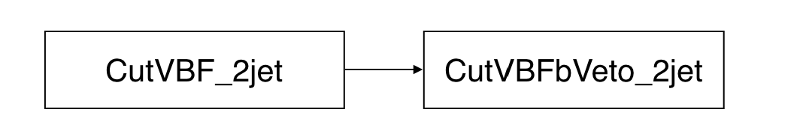
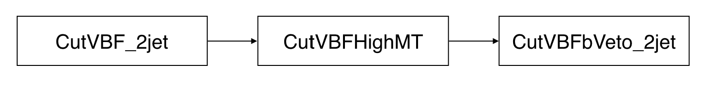
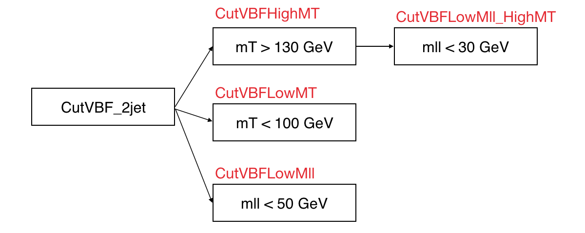

# Cuts

## Tutorial \(from [gitlab](https://gitlab.cern.ch/atlas-physics/higgs/hww/HWWAnalysisCode/tree/master/share/config/cuts/common#cuts)\)

The syntax is described in the [gitlab](https://gitlab.cern.ch/atlas-physics/higgs/hww/HWWAnalysisCode/tree/master/share/config/cuts/common#cuts). I copy and paste in the following. 

The cuts for the analysis can and should be defined with an external configuration file.

### Usage

The syntax is the `TQFolder` text syntax, which follows the general idea of constructing the cut hierarchy as a tree of `TQFolders`, and then converting these into instances of `TQCut`.

```text
# This is a comment.
+CutBase { # this is a new folder and soon-to-be cut. there is no folder above, so this is the base cut
# The tags '.cutExpression' and '.weightExpression' will become the cut and weight expressions of the `TQCut`.
  +CutLeptonPt { # this is a new child cut of CutBase
    <.cutExpression="lepton_pts[0] > $(lepPtCut) * 1000.", .weightExpression = "1.">
  }   
}
```

Please note the use of the string `$(lepPtCut)` in the above expression. This is a placeholder variable that will be filled by the code at runtime. There are several ways to give such placeholder variables meaning:

* The values can be defined as a global `alias`. Aliases are basically global string-replacements that you can define in a separate config file in order to keep your files human-readable.
* In cases where different values should be used for different samples \(or groups thereof\), the individual values can be defined as tags on the sample folder hierarchy. These can be defined in `patches` that you can apply to your sample folder at will.

### Advanced Features

For complicated analyses, your cut hierarchy can get quite large. However, the `TQFolder` text syntax is very powerful and can be exploited to keep your config files nice and clean. Consider, for example, a case where you want to attach the same set of cuts to multiple regions.

```text
+ChannelSelection{
  <.cutExpression="EventType=$(channelEnum)", .weightExpression="mcEventWeight">
  +CutA {
    <.cutExpression="$(VarA)>20.">
    +CutB {
      <.cutExpression="$(VarB)<30.">
      +CR_Bkg1 {
        <.cutExpression="$(lepPt1)<30.">        
      }     
      +CR_Bkg2 {
        <.cutExpression="$(lepPt2)<30.">        
      }
    }
  }
}

@*/CR_*{
  +BDTcut {
    <.name="BDTcut_$(CR)",.cutExpression="[MVA:tmva_xmls/mybdttraining.xml]>0.1">
    +MTcut {
      <.name="MTcut_$(CR)",.cutExpression="$(MT)>30">
    }
  }
}

$replace("*/CR_Bkg1/*:.name",CR="CR_Bkg1");
$replace("*/CR_Bkg2/*:.name",CR="CR_Bkg2");
```

Note how the `@*/CR_*` selects all folders matching a certain path, such that then, the same block of additional cuts can be created there. Then, in order to make each cut have a unique name \(which is a requirement of the framework\), the `$replace` command is used to replace the placeholder `$(CR)` in the `.name` tag with the corresponding name component.

## Introduction

In our analysis, we have two cut files included in default. The cut file, `default-couplings.def`, is for pre-selection and the other, said `VBF.def`, will include the selections for the VBF-enriched phase space.

#### default-couplings.def

The analysis starts with `CutChannels` stage, which is just after the PxAOD production. A series of cuts are followed by `CutChannels`. 

#### VBF.def

The VBF selection starts with the `CutFF` stage, which is the region selected in the `default-couplings.def`. Then, the following cuts after `CutFF` stage in the VBF cut files are optimized with the physical meanings. You can find why we would like to select these cuts in the [Run-1 paper](https://arxiv.org/abs/1412.2641) or on p.2 to p.5 in the [slides](https://indico.cern.ch/event/714538/contributions/3020450/attachments/1660371/2659743/VBF_HWWworkshop_20180601.pdf). 

Our VBF signal regions are defined in the `CutVBFZttVeto_2jet`. Then we use BDT score as distribution to fit and get the results. 

## Hands-on sessions

### Select your own selection

#### Question

This is the phase space `CutVBFbVeto_2jet`, which we called VBF pre-selection region. The selections are summarized in the following figure. If we would like to add a high mT selection, said `mT > 130 GeV`, between`CutVBF_2jet` and `CutVBFbVeto_2jet` regions, what should we do?

```text
+CutVBF_2jet {
	  <.name ="CutVBF_2jet",.cutExpression = "$(nJetsTight)>=2", .title="2-jet (30,30) fJVT">
    	+CutVBFbVeto_2jet {
	    	<.cutExpression = "[nBJetsSubMV2c10] < 1", .weightExpression = "bTagWeight", .title="b-veto">
		}
}
```



#### Answer

The followings are the steps we did to add a new selection.

* Define the name of selection like `CutVBFHighMT`
* Add the `cutExpression` , which is used to define your selection
* Add the title to let people know how you select. The Latex format is supported.
* Don't forget to add your curly brackets!

```text
+CutVBF_2jet {
	  <.name ="CutVBF_2jet",.cutExpression = "$(nJetsTight)>=2", .title="2-jet (30,30) fJVT">
		+CutVBFHighMT{
			  <.name ="CutVBFHighMT",.cutExpression = "$(MT)>130", .title="$M_{T}$>130 GeV">
		}
    		+CutVBFbVeto_2jet {
	    		<.cutExpression = "[nBJetsSubMV2c10] < 1", .weightExpression = "bTagWeight", .title="b-veto">
			}
}
```

The figure below summarizes how the cuts work after adding the `CutVBFHighMT` selection.



### Select different phase spaces

#### Question

Can we select several parallel cuts?

#### Answer

Yes! For example, we would like to select three parallel regions after `CutVBF_2jet` region like \(shown as figure\)

* a high mT selection, said `mT > 130 GeV`
  * with a following low mll selection, `mll < 30 GeV`
* a low mT region, said `mT > 130 GeV`
* a low mll region, said `mll < 50 GeV`



Here is how the code will look like

```text
+CutVBF_2jet {
	  <.name ="CutVBF_2jet",.cutExpression = "$(nJetsTight)>=2", .title="2-jet (30,30) fJVT">
		+CutVBFHighMT{
			<.name ="CutVBFHighMT",.cutExpression = "$(MT)>130", .title="$M_{T}$>130 GeV">
			+CutVBFLowMll_HighMT{
				<.name ="CutVBFLowMll_HighMT",.cutExpression = "$(Mll)<30", .title="$M_{ll}$<30 GeV">
			}
		}
		+CutVBFLowMT{
			  <.name ="CutVBFLowMT",.cutExpression = "$(MT)<100", .title="$M_{T}$<100 GeV">
		}
		+CutVBFLowMll{
			  <.name ="CutVBFLowMll",.cutExpression = "$(Mll)<50", .title="$M_{ll}$<50 GeV">
		}
}
```

