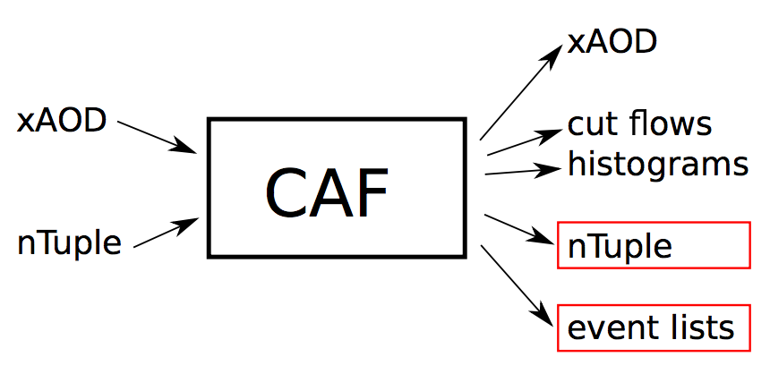

# Dumping Ntuple and Eventlists

## Introduction

We have an introduction [**slide**](https://indico.cern.ch/event/771763/contributions/3207862/attachments/1767975/2871431/sauerburger2018-12-10_dump.pdf) for nTuple dumping. Dumping nTuple is to covert our sample format to a more accessible data format, a flat nTuple!



## Booking nTuple

We should define the nTuple definition in the analyze config file. In practice, we add the following line:


```text
ntuples: config/nTuples/VBF/mva_ntuple.txt
```


Here we define the nTuple definition. We book a tree, called skim, and several branches for different variables. 


```text
# Define branches (make sure that this is a single line)
skim: int evt_num << EventInfo.eventNumber(), int isEM << [ "$(channel)"=="em" ] , int isME << [ "$(channel)"=="me" ], float lep0_pt << $(lep0).pt(), float lep0_phi << $(lep0).phi(), float lep0_eta << $(lep0).eta();

# Book at cuts
# $(channel) is to define in config/patches/common/default-patch.txt 
@CutVBF_2jet: skim >> dump/mva_ntuple.root:HWW_$(channel)

# We can also separate the processes as different root files 
# $(ntupName) is to define in config/patches/VBF/patch-VBF-MVA.txt
@CutVBF_2jet: skim >> dump/$(ntupName).root:HWW_$(channel)
```


## Dumping nTuple

### Define the labels for your nTuple

We can create a file to include the labels which will allow us to define the variables to distinguish processes.

```text
config/patches/VBF/patch-VBF-MVA.txt
```


```text
<ntupName = "ggf"> @/sig/?/?/mh125/ggf;
<ntupName = "vbf"> @/sig/?/?/mh125/vbf;
<ntupName = "WW"> @/bkg/?/?/diboson/WW;
<ntupName = "Ztt"> @/bkg/?/?/Zjets/?/?/tt/;
<ntupName = "ttbar"> @/bkg/?/?/top/ttbar;
<ntupName = "Wt"> @/bkg/?/?/top/singletop/Wt;
```


### Define the jobs to run parallel

```text
config/jobLists/VBF/jobs-MVA.txt
```


```text
/sig/?/?/mh125/ggf/
/sig/?/?/mh125/vbf/
/bkg/?/?/diboson/WW/
/bkg/?/?/Zjets/?/?/tt/
/bkg/?/?/top/ttbar/
/bkg/?/?/top/singletop/Wt
```


### Submit to dump nTuple

We can then use **submit.py** to run the analysis parallel.

```bash
./submit.py config/master/VBF/analyze-VBF-Coupling-2018.cfg --jobs config/jobLists/VBF/jobs-MVA.txt --identifier VBF_nTuple_dumping
```


Please note that we cannot use --maxSampleCount and --maxSampleSize here, since the jobs will be split. All the jobs may possibly overwrite the same nTuple files!


