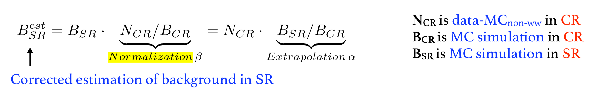

# Jargon

## Introduction

### General

* **Legacy paper** means the publication with full dataset. 

### Analysis

* **Nominal samples:** samples as our baseline without variations
* **Variation samples**: samples with theoretical or systematic variations to estimate the contribution from systematics
* **MC weight**: 
* **Signal region \(SR\)** is the region where the signals populate
* **Control Region \(CR\)** is the region dominated by some specific background and the CR is then used to **constraint MC simulated samples with data**
  * A control region should be **pure** and **with enough statistics**
  * A control region should be **close** but **orthogonal** to SR
* **Cut efficiency** is the efficiency of the cut selection

$$
\text{Cut efficiency} = \frac{\text{number of events after cut}}{\text{number of events before cut}}
$$

* **Purity** is the ratio of the specific background to all background in some specific phase space \(region\).

$$
\text{Purity} = \frac{\text{number of specific background}}{\text{number of all background}}
$$

* **Normalization factor \(NF or β\) and extrapolation factor \(α\)** are used to correct the background estimation in the signal region \(SR\).

* **Normalization factor** is calculated by \(take WW NF as example\)

$$
\text{NF} = \frac{\text{data in CR}-\text{MC}_\text{non-WW}\text{ in CR}}{\text{MC}_\text{WW}\text{ in SR}}
$$

* [Good Run lists](https://twiki.cern.ch/twiki/bin/viewauth/AtlasProtected/GoodRunListsForAnalysisRun2)
* \*\*\*\*

### Abbreviation

* **SF** can be two different abbreviations:
  * **Scale factor**: factors applied on the MC samples to correct the difference between MC and data
  * **Same flavor:** this means the lepton flavor are different in the final state
* **OS** and **SS** represent the opposite-signed and same-signed \(leptons\) in the HWW analysis

$$
\text{B}^{\text{est}}_{\text{SR}} = \text{B}_{\text{SR}} \dot
$$

### English

* **w/** and **w/o** mean _with_ and _without_

