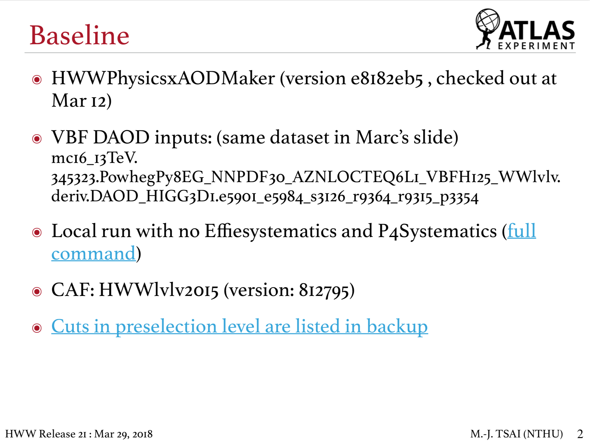
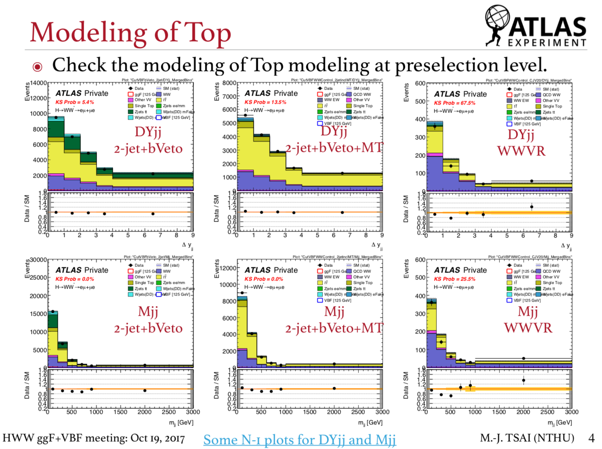

# Documents

## Recommendation for slides

Since we present the results and discuss the physics by slides, clear and detailed slides are important and required. Moreover, we're not native speakers, therefore, we should let the audiences easily understand your fantastic results and what you're talking about. Here, I try to summarize some of tips to follow. Hope it will help for you to make a good presentations. 

I try to suggest some tips and recommendations which are suggested by Jennifer. 

### Title page

It's kind of important to let people know who you are, which university contribute to this topic and what you're working on. So, we should 

* make the title clear 
* add names of yourself, supervisor \(Jennifer\), postdoc and collaborators. 
* add the name of your university \(NTHU absolutely!\)
* include the date and meeting where you will present your results

### Introduction and baseline

#### Introduction

In your introduction, you can summarize your works in the slides and give a brief overview of your slides. 

* If you've presented the related topics in the previous meetings, you **should add a link to your previous presentations** to let people keep up with what you've done before. 
* Keep only new \(w.r.t. previous talk\) information for the Introduction

#### Baseline

* Always put your baseline in the introduction or backup to make people know what you've done. For example, you should mention
  * the commit \(version\) of the analysis/production codes
  * the versions of the samples you run like R21, V19 PxAOD or EMTopo etc. 
  * your specific configurations to finish your work
  * difference between your setup and master branch

#### Present your results

To present the results, you could try to

* generate the histograms 
  * with good binning
  * with conspicuous legends and texts
  * with KS probability to easily check if the data and MC are similar enough
  * with a good range of y-axis for subplot to cover the data/MC ratios
* Always put clear and conspicuous texts on the histograms and cutflows to let audience read your slides easily. With what you want to show, you can mention like
  * the flavor of the final states like ee, μμ, eμ or μe. 
  * the cut stage \(phase space\) where the histogram is
  * the physical observables used in the histograms
* Highlight bins if there are something new, interesting or problematic.

* Calculate the [cut efficiencies ](../physics_analysis/jargons.md#analysis)for the selections you're working on. When discussing selections, **mention cut efficiencies** instead of mentioning the terms, _many, some, few and a lot, ...etc._
* * Add kinematics of physical objects, including jets, leptons and MET, in the backup or other slides as references. 
* Always put the commits or version of the analysis

## Posters

#### TPS 2019

* [Estimation of the WW Background and Possible Improvement in the H→WW\* Analysis with the Atlas Detector](https://drive.google.com/file/d/14xImdVBoQZHqFIZdcodx_E0g0pKV8MUk/view?usp=sharing)

#### TPS 2018

* [Estimation of WW Background in the H→WW\* Analysis with the ATLAS Detector](https://drive.google.com/file/d/1PrEomiuHYetZCXbeF_qHZpmws60qW_16/view?usp=sharing)

## Thesis template

I have put the [GitHub link](https://github.com/mengjutsai/NTHU-HEP-Master-Thesis) for Latex template of the thesis. You may clone the repository and write you thesis from scratch. 

## 

